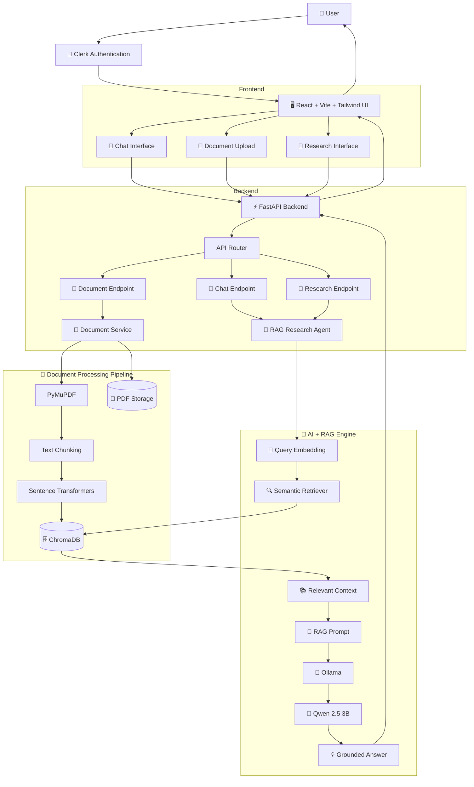
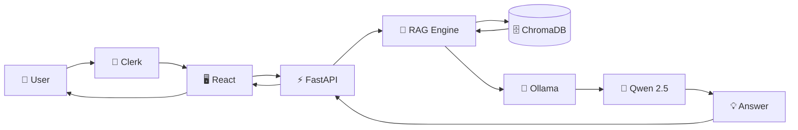
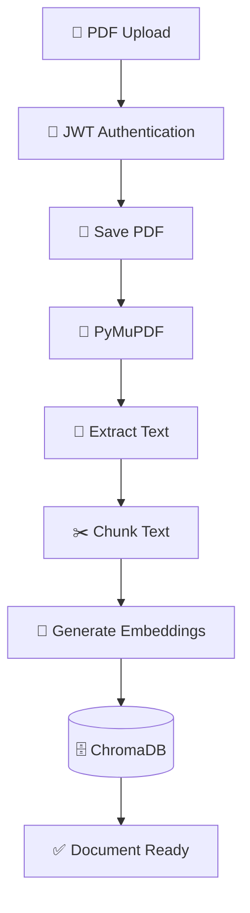
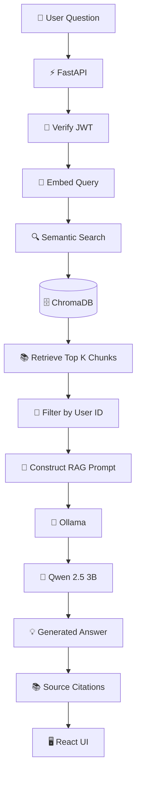
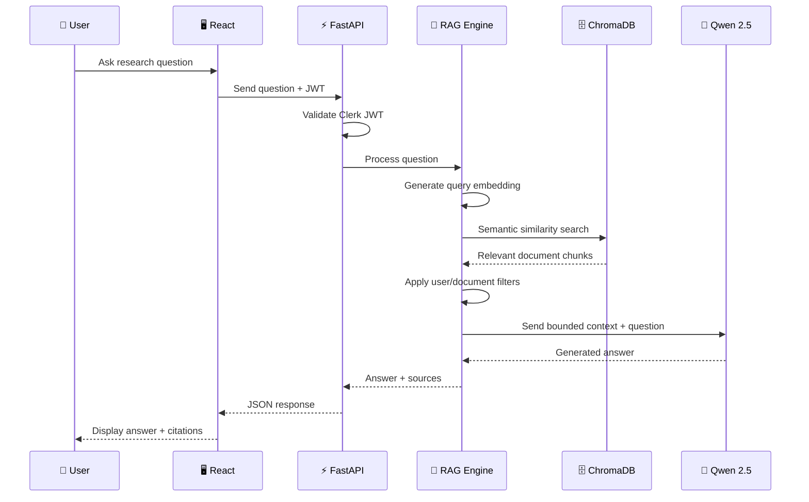
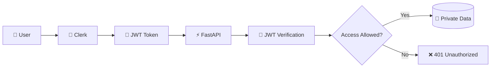
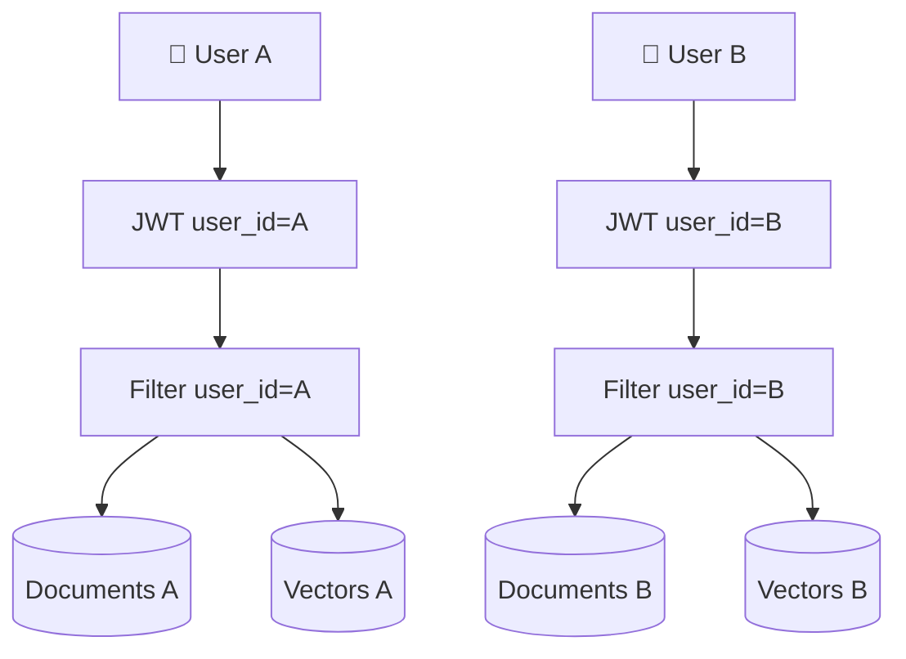
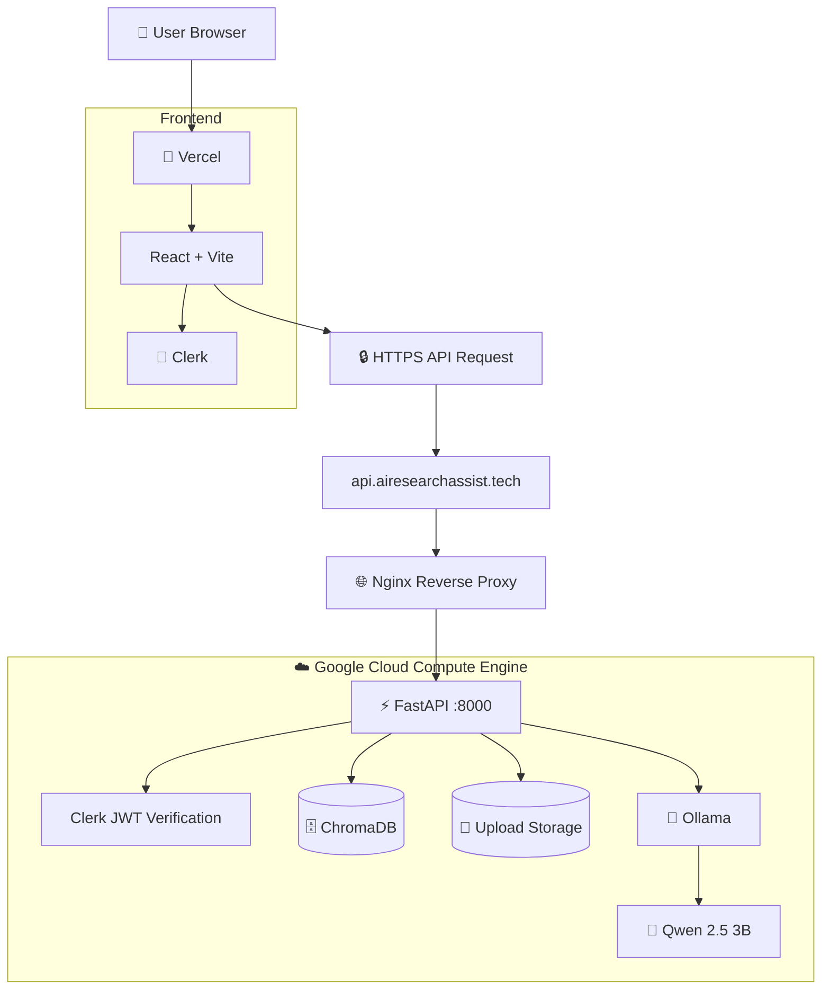
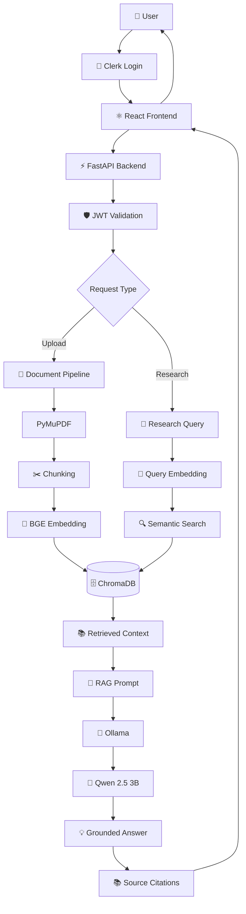

# 🧠 AI Research Assistant

### RAG-Based Private Document Intelligence Platform

DEMO : https://www.airesearchassist.tech

A production-oriented, self-hosted **AI Research Assistant** that allows users to securely upload PDF documents, search their private document library, and ask context-aware questions using **Retrieval-Augmented Generation (RAG)**.

The system combines:

* ⚛️ React + Vite + Tailwind CSS
* ⚡ FastAPI
* 🔐 Clerk Authentication
* 📄 PyMuPDF
* 🔢 Sentence Transformers
* 🗄️ ChromaDB
* 🤖 Qwen 2.5 3B
* 🦙 Ollama
* ☁️ Google Cloud Compute Engine
* 🌐 Nginx + SSL
* 🚀 Vercel

The AI inference pipeline runs locally on the Google Cloud backend using **BAAI/bge-small-en-v1.5** for embeddings and **Qwen 2.5 3B** through Ollama for generation, keeping document content and research queries inside the controlled infrastructure.

---

# 📌 Table of Contents

* [Executive Summary](#-executive-summary)
* [Key Features](#-key-features)
* [Problem Statement](#-problem-statement)
* [Solution](#-solution)
* [Technology Stack](#-technology-stack)
* [Complete System Architecture](#-complete-system-architecture)
* [Repository Structure](#-repository-structure)
* [Document Ingestion Pipeline](#-document-ingestion-pipeline)
* [RAG Query Pipeline](#-rag-query-pipeline)
* [Authentication and Security](#-authentication-and-security)
* [Multi-Tenant Isolation](#-multi-tenant-isolation)
* [Deployment Architecture](#-deployment-architecture)
* [Backend Architecture](#-backend-architecture)
* [Frontend Architecture](#-frontend-architecture)
* [API Flow](#-api-flow)
* [Installation](#-installation)
* [Production Deployment](#-production-deployment)
* [Environment Variables](#-environment-variables)
* [Project Workflow](#-project-workflow)
* [Future Improvements](#-future-improvements)
* [License](#-license)

---

# 🚀 Executive Summary

The **AI Research Assistant** is a private RAG-based document intelligence platform designed for researchers, developers, students, analysts, and organizations that need to interact with their documents using natural language.

Users can:

1. 🔐 Sign in securely.
2. 📄 Upload PDF documents.
3. 🔎 Search their document library.
4. 💬 Ask questions about documents.
5. 🧠 Retrieve relevant document context.
6. 🤖 Generate answers using a local LLM.
7. 📚 View source references containing filename, page number, and matched content.

The platform follows a **context-bounded RAG architecture**, meaning the language model receives relevant retrieved document context rather than relying only on its general knowledge.

---

# ✨ Key Features

## 🔐 Secure Authentication

Authentication is handled using **Clerk**.

The frontend obtains an authenticated session token and sends it with API requests. The FastAPI backend validates the token before allowing access to protected resources.

---

## 📄 Private PDF Upload

Users can upload PDF documents to their personal document workspace.

The backend:

```text
PDF
 ↓
Authentication
 ↓
File Storage
 ↓
PyMuPDF
 ↓
Text Extraction
 ↓
Text Chunking
 ↓
Embedding Generation
 ↓
ChromaDB
```

---

## 🧠 Retrieval-Augmented Generation

Instead of directly sending a user question to an LLM:

```text
User Question
      ↓
Embedding
      ↓
Semantic Search
      ↓
Relevant Document Chunks
      ↓
Context Construction
      ↓
Qwen 2.5
      ↓
Grounded Answer
```

This allows the assistant to answer questions based on the user's uploaded documents.

---

## 🔎 Semantic Search

Documents are converted into vector embeddings using:

```text
BAAI/bge-small-en-v1.5
```

The embeddings are stored in persistent **ChromaDB** and retrieved using semantic similarity.

---

## 📚 Source Citations

Generated responses can provide document references such as:

```text
Document: research-paper.pdf
Page: 12

Matched Content:
"...relevant passage from the document..."
```

This makes research answers easier to verify.

---

## 👥 Multi-Tenant Document Isolation

Each user's documents are isolated using:

```text
user_id
+
document metadata
+
user-specific storage
```

Therefore:

```text
User A
 ├── document_1.pdf
 ├── document_2.pdf
 └── document_3.pdf

User B
 ├── document_4.pdf
 └── document_5.pdf
```

User A cannot retrieve User B's documents.

The original design specifically uses sandbox directories and metadata filtering to enforce this isolation.

---

# 🎯 Problem Statement

Traditional AI assistants often require users to upload sensitive documents to third-party AI APIs.

This creates potential concerns around:

* Data privacy
* Intellectual property
* Confidential research
* Internal company documents
* Financial information
* Proprietary code
* Compliance requirements

The goal of this project is to provide a **self-hosted document intelligence solution** where documents remain inside infrastructure controlled by the application owner.

---

# 💡 Solution

The system uses a local RAG architecture:

```text
                    ┌─────────────────────┐
                    │      User           │
                    └──────────┬──────────┘
                               │
                               ▼
                    ┌─────────────────────┐
                    │ React Web Interface │
                    └──────────┬──────────┘
                               │
                               ▼
                    ┌─────────────────────┐
                    │   FastAPI Backend   │
                    └──────────┬──────────┘
                               │
                ┌──────────────┴──────────────┐
                │                             │
                ▼                             ▼
       ┌─────────────────┐          ┌─────────────────┐
       │ Document Engine │          │   RAG Engine    │
       └────────┬────────┘          └────────┬────────┘
                │                            │
                ▼                            ▼
          ┌──────────┐                 ┌──────────┐
          │ ChromaDB │                 │  Ollama  │
          └──────────┘                 └────┬─────┘
                                            │
                                            ▼
                                      Qwen 2.5 3B
```

---

# 🛠️ Technology Stack

## Frontend

| Technology     | Purpose               |
| -------------- | --------------------- |
| React          | UI framework          |
| Vite           | Frontend build tool   |
| Tailwind CSS   | Styling               |
| Clerk          | Authentication        |
| Axios          | API communication     |
| React Markdown | AI response rendering |

The frontend is designed as a responsive single-page application with a premium dark interface.

---

## Backend

| Technology               | Purpose          |
| ------------------------ | ---------------- |
| Python                   | Backend language |
| FastAPI                  | REST API         |
| Uvicorn                  | ASGI server      |
| Pydantic                 | Data validation  |
| Jose                     | JWT verification |
| PyMuPDF                  | PDF processing   |
| LangChain Text Splitters | Text chunking    |

---

## AI / RAG

| Technology             | Purpose              |
| ---------------------- | -------------------- |
| Sentence Transformers  | Embedding generation |
| BAAI/bge-small-en-v1.5 | Embedding model      |
| ChromaDB               | Vector database      |
| Ollama                 | Local LLM runtime    |
| Qwen 2.5 3B            | Local language model |

These components form the core AI and vector layer described in the project design.

---

## Infrastructure

| Technology                  | Purpose                    |
| --------------------------- | -------------------------- |
| Google Cloud Compute Engine | Backend server             |
| Ubuntu                      | Server OS                  |
| Nginx                       | Reverse proxy              |
| Let's Encrypt               | SSL                        |
| Systemd                     | Backend process management |
| Vercel                      | Frontend deployment        |

---

# 🏗️ Complete System Architecture



---

# 🔄 High-Level Application Flow



---

# 📄 Document Ingestion Pipeline

When a user uploads a PDF:



### Processing stages

```text
PDF
 ↓
JWT Validation
 ↓
Store File
 ↓
PyMuPDF Extraction
 ↓
Page-Level Text
 ↓
Recursive Chunking
 ↓
Sentence Transformer
 ↓
Vector Embeddings
 ↓
ChromaDB
```

The project uses PyMuPDF for page-level extraction and recursive text splitting before generating local embeddings.

---

# 🔍 RAG Query Pipeline

When the user asks a research question:



---

# 🔬 Semantic Research Flow



---

# 🔐 Authentication and Security



### Security model

```text
User
 ↓
Clerk Authentication
 ↓
JWT
 ↓
FastAPI
 ↓
JWT Verification
 ↓
Extract user_id
 ↓
Apply user-level filtering
 ↓
Access private resources
```

The backend uses JWT verification and dynamic Clerk JWKS verification to protect API resources.

---

# 👥 Multi-Tenant Isolation

The platform is designed around strict user-level isolation.



### Isolation principle

```text
Every request
      ↓
Authenticate user
      ↓
Extract user_id
      ↓
Filter document metadata
      ↓
Search only authorized vectors
      ↓
Return authorized results
```

This prevents one user from searching or accessing another user's document collection.

---

# 📚 Context-Bounded Generation

The RAG engine follows a controlled generation strategy:

```text
User Question
      ↓
Retrieve relevant chunks
      ↓
Build context
      ↓
Send context + question
      ↓
Qwen 2.5
      ↓
Answer only from available context
```

If the required information is not available in the retrieved context, the assistant can return a fallback such as:

```text
I couldn't find that information in the provided documents.
```

This design helps reduce unsupported answers and keeps responses grounded in the user's document collection.

---

# 📁 Repository Structure

```text
ai-research-assistant/
│
├── backend/
│   │
│   ├── app/
│   │   │
│   │   ├── api/
│   │   │   ├── endpoints/
│   │   │   │   ├── auth.py
│   │   │   │   ├── chat.py
│   │   │   │   ├── documents.py
│   │   │   │   ├── research.py
│   │   │   │   └── health.py
│   │   │   │
│   │   │   └── router.py
│   │   │
│   │   ├── core/
│   │   │   ├── config.py
│   │   │   ├── security.py
│   │   │   └── logging.py
│   │   │
│   │   ├── db/
│   │   │   ├── chroma.py
│   │   │   └── database.py
│   │   │
│   │   ├── agents/
│   │   │   ├── research_agent.py
│   │   │   ├── rag_agent.py
│   │   │   └── summarization_agent.py
│   │   │
│   │   ├── services/
│   │   │   ├── document_service.py
│   │   │   ├── embedding_service.py
│   │   │   ├── llm_service.py
│   │   │   └── retrieval_service.py
│   │   │
│   │   └── main.py
│   │
│   ├── data/
│   │   ├── chromadb/
│   │   └── uploads/
│   │
│   ├── requirements.txt
│   └── .env.example
│
├── frontend/
│   │
│   ├── public/
│   │   ├── favicon.ico
│   │   └── assets/
│   │
│   ├── src/
│   │   ├── assets/
│   │   │
│   │   ├── components/
│   │   │   ├── ui/
│   │   │   ├── Chat/
│   │   │   ├── DocumentUpload/
│   │   │   ├── Research/
│   │   │   └── Layout/
│   │   │
│   │   ├── context/
│   │   │   ├── AuthContext.jsx
│   │   │   └── ChatContext.jsx
│   │   │
│   │   ├── hooks/
│   │   │   ├── useChat.js
│   │   │   └── useDocuments.js
│   │   │
│   │   ├── pages/
│   │   │   ├── Home.jsx
│   │   │   ├── Research.jsx
│   │   │   ├── Documents.jsx
│   │   │   └── Login.jsx
│   │   │
│   │   ├── services/
│   │   │   ├── api.js
│   │   │   ├── chatService.js
│   │   │   └── documentService.js
│   │   │
│   │   ├── App.jsx
│   │   └── main.jsx
│   │
│   ├── package.json
│   ├── tailwind.config.js
│   ├── vite.config.js
│   └── .env.example
│
└── README.md
```

---

# 🧩 Backend Architecture

The backend follows a modular architecture:

```text
backend/
│
└── app/
    │
    ├── api/
    │   └── endpoints/
    │       ├── auth.py
    │       ├── chat.py
    │       ├── documents.py
    │       ├── research.py
    │       └── health.py
    │
    ├── core/
    │   ├── config.py
    │   ├── security.py
    │   └── logging.py
    │
    ├── agents/
    │   ├── research_agent.py
    │   ├── rag_agent.py
    │   └── summarization_agent.py
    │
    ├── services/
    │   ├── document_service.py
    │   ├── embedding_service.py
    │   ├── llm_service.py
    │   └── retrieval_service.py
    │
    ├── db/
    │   ├── chroma.py
    │   └── database.py
    │
    └── main.py
```

### Responsibilities

| Module      | Responsibility                  |
| ----------- | ------------------------------- |
| `api/`      | REST API endpoints              |
| `core/`     | Configuration and security      |
| `agents/`   | AI/RAG orchestration            |
| `services/` | Business and AI services        |
| `db/`       | ChromaDB/database integration   |
| `main.py`   | FastAPI application entry point |

---

# 🖥️ Frontend Architecture

```text
frontend/
│
└── src/
    │
    ├── components/
    │   ├── ui/
    │   ├── Chat/
    │   ├── DocumentUpload/
    │   ├── Research/
    │   └── Layout/
    │
    ├── context/
    │   ├── AuthContext.jsx
    │   └── ChatContext.jsx
    │
    ├── hooks/
    │   ├── useChat.js
    │   └── useDocuments.js
    │
    ├── pages/
    │   ├── Home.jsx
    │   ├── Research.jsx
    │   ├── Documents.jsx
    │   └── Login.jsx
    │
    ├── services/
    │   ├── api.js
    │   ├── chatService.js
    │   └── documentService.js
    │
    ├── App.jsx
    └── main.jsx
```

---

# 🌐 Deployment Architecture



The production deployment uses Vercel for the frontend and a Google Cloud Ubuntu VM with Nginx and SSL protection for the backend.

---

# 🔒 Production Network Flow

```text
User Browser
     │
     │ HTTPS
     ▼
Vercel
     │
     │ HTTPS + JWT
     ▼
api.airesearchassist.tech
     │
     ▼
Nginx
     │
     │ localhost:8000
     ▼
FastAPI
     │
     ├───────────────┐
     ▼               ▼
ChromaDB          Ollama
                     │
                     ▼
                 Qwen 2.5
```

---

# ⚙️ Installation

## 1. Clone Repository

```bash
git clone https://github.com/DBalakrishna4599/ai-research-assistant-rag.git

cd ai-research-assistant-rag
```

---

# 🐍 Backend Setup

```bash
cd backend

python3 -m venv venv

source venv/bin/activate

pip install --upgrade pip

pip install -r requirements.txt
```

---

# 🦙 Install Ollama

Install Ollama:

```bash
curl -fsSL https://ollama.com/install.sh | sh
```

Download Qwen:

```bash
ollama pull qwen2.5:3b
```

Verify:

```bash
ollama list
```

---

# ▶️ Run Backend

```bash
cd backend

source venv/bin/activate

uvicorn app.main:app --host 0.0.0.0 --port 8000
```

Backend:

```text
http://localhost:8000
```

API documentation:

```text
http://localhost:8000/docs
```

---

# ⚛️ Frontend Setup

```bash
cd frontend

npm install

npm run dev
```

Frontend:

```text
http://localhost:5173
```

---

# 🔑 Environment Variables

## Backend

Create:

```text
backend/.env
```

Example:

```env
PORT=8000
HOST=0.0.0.0
ENV=production

ALLOWED_ORIGINS=http://localhost:5173

CLERK_API_URL=https://api.clerk.com
CLERK_JWKS_URL=YOUR_CLERK_JWKS_URL

CHROMA_DB_DIR=./data/chromadb
UPLOADS_DIR=./data/uploads

OLLAMA_BASE_URL=http://localhost:11434

EMBEDDING_MODEL_NAME=BAAI/bge-small-en-v1.5
LLM_MODEL_NAME=qwen2.5:3b
```

---

## Frontend

Create:

```text
frontend/.env
```

Example:

```env
VITE_CLERK_PUBLISHABLE_KEY=YOUR_CLERK_PUBLISHABLE_KEY
VITE_API_BASE_URL=http://localhost:8000
```

---

# ☁️ Production Deployment

## Google Cloud VM

Install required packages:

```bash
sudo apt update

sudo apt upgrade -y

sudo apt install \
python3-pip \
python3-venv \
git \
build-essential \
nginx \
certbot \
python3-certbot-nginx \
-y
```

---

# 🚀 Backend Production Setup

```bash
git clone https://github.com/DBalakrishna4599/ai-research-assistant-rag.git

cd ai-research-assistant-rag/backend

python3 -m venv venv

source venv/bin/activate

pip install --upgrade pip setuptools wheel

pip install -r requirements.txt
```

---

# 🌐 Nginx Configuration

Create:

```bash
sudo nano /etc/nginx/sites-available/api
```

Configuration:

```nginx
server {
    server_name api.airesearchassist.tech;

    location / {
        proxy_pass http://127.0.0.1:8000;

        proxy_set_header Host $host;
        proxy_set_header X-Real-IP $remote_addr;
        proxy_set_header X-Forwarded-For $proxy_add_x_forwarded_for;
        proxy_set_header X-Forwarded-Proto $scheme;

        client_max_body_size 50M;
    }
}
```

Enable configuration:

```bash
sudo ln -s /etc/nginx/sites-available/api \
/etc/nginx/sites-enabled/api
```

Test:

```bash
sudo nginx -t
```

Restart:

```bash
sudo systemctl restart nginx
```

---

# 🔐 SSL Configuration

```bash
sudo certbot --nginx \
-d api.airesearchassist.tech
```

This provides HTTPS for the production backend.

---

# ⚡ Systemd Backend Service

Create:

```bash
sudo nano /etc/systemd/system/assistant-backend.service
```

Add:

```ini
[Unit]
Description=FastAPI AI Research Assistant Backend
After=network.target

[Service]
User=YOUR_USERNAME

WorkingDirectory=/home/YOUR_USERNAME/ai-research-assistant/backend

ExecStart=/home/YOUR_USERNAME/ai-research-assistant/backend/venv/bin/uvicorn app.main:app --host 0.0.0.0 --port 8000

Restart=always
RestartSec=5

EnvironmentFile=/home/YOUR_USERNAME/ai-research-assistant/backend/.env

[Install]
WantedBy=multi-user.target
```

Enable:

```bash
sudo systemctl daemon-reload

sudo systemctl enable assistant-backend.service

sudo systemctl start assistant-backend.service
```

Check:

```bash
sudo systemctl status assistant-backend.service
```

---

# 🚀 Frontend Deployment

Build locally:

```bash
cd frontend

npm install

npm run build
```

Deploy the `frontend` directory to Vercel.

Set:

```env
VITE_CLERK_PUBLISHABLE_KEY=YOUR_KEY

VITE_API_BASE_URL=https://api.airesearchassist.tech
```

---

# 🔌 API Flow

## Upload Document

```text
POST /documents/upload
```

Flow:

```text
React
 ↓
Axios
 ↓
JWT
 ↓
FastAPI
 ↓
Authentication
 ↓
PDF Processing
 ↓
Embedding
 ↓
ChromaDB
```

---

## Get Documents

```text
GET /documents
```

Returns the authenticated user's documents.

---

## Delete Document

```text
DELETE /documents/{document_id}
```

Deletes the authorized document and associated vector data.

---

## Chat

```text
POST /chat
```

Flow:

```text
Question
 ↓
JWT Validation
 ↓
Query Embedding
 ↓
ChromaDB Search
 ↓
User Filtering
 ↓
Context Construction
 ↓
Qwen 2.5
 ↓
Answer
```

---

## Research

```text
POST /research
```

Used for research-oriented document queries and RAG-based responses.

---

# 🧠 Core RAG Components

```text
                 RAG ENGINE
                     │
       ┌─────────────┼─────────────┐
       │             │             │
       ▼             ▼             ▼
   Embedding     Retrieval      Generation
       │             │             │
       ▼             ▼             ▼
 BGE-small       ChromaDB       Qwen 2.5
       │             │             │
       └─────────────┴─────────────┘
                     │
                     ▼
               Grounded Answer
```

---

# 📊 Data Flow

## Upload

```text
PDF
 ↓
FastAPI
 ↓
PyMuPDF
 ↓
Text
 ↓
Chunking
 ↓
BGE Embedding
 ↓
ChromaDB
```

## Query

```text
Question
 ↓
BGE Embedding
 ↓
ChromaDB
 ↓
Top-K Chunks
 ↓
RAG Prompt
 ↓
Qwen 2.5
 ↓
Answer
```

---

# 🛡️ Privacy Architecture

The platform follows a local-first inference model:

```text
                     INTERNET
                         │
                         X
                         │
                External LLM APIs
                         │
                         X
                         │
                     BLOCKED


User
 │
 ▼
Frontend
 │
 ▼
GCP Backend
 │
 ├── ChromaDB
 ├── PDF Storage
 ├── BGE Embeddings
 └── Ollama
       │
       ▼
   Qwen 2.5
```

Document chunks and queries remain within the application's controlled infrastructure rather than being sent to external commercial LLM providers.

---

# 🎓 Why RAG?

Large Language Models have general knowledge but may not know the contents of a user's private documents.

RAG solves this by combining:

```text
Retrieval
    +
Generation
    =
Grounded AI Response
```

### Without RAG

```text
Question
   ↓
LLM
   ↓
General Answer
```

### With RAG

```text
Question
   ↓
Vector Search
   ↓
Private Documents
   ↓
Relevant Context
   ↓
LLM
   ↓
Document-Grounded Answer
```

---

# 📈 Advantages

### 🔐 Privacy

Documents remain inside controlled infrastructure.

### 🎯 Accuracy

Responses are grounded using retrieved document context.

### 👥 Multi-Tenancy

Users have isolated document collections.

### ⚡ Local Inference

Embeddings and LLM inference run locally.

### 📚 Explainability

Responses can provide source references.

### 🧩 Modular Architecture

Frontend, API, AI services, database, and storage are independently organized.

### 🚀 Scalable Foundation

The architecture can be extended with additional AI agents, databases, and retrieval strategies.

---

# 🔮 Future Improvements

Potential improvements include:

* 🌐 Web search integration
* 📊 Research analytics dashboard
* 🧠 Multiple specialized research agents
* 📑 DOCX/PPTX support
* 🖼️ Image and table extraction
* 🔍 Hybrid keyword + vector search
* 🧮 Reranking models
* 💾 Conversation persistence
* 📈 Usage analytics
* 🔔 Background document processing
* 🧪 RAG evaluation pipeline
* 🐳 Docker deployment
* ☸️ Kubernetes deployment
* ⚡ Streaming LLM responses
* 📚 Automatic bibliography generation

---

# 📌 Project Highlights

```text
┌───────────────────────────────────────────────┐
│          AI RESEARCH ASSISTANT                │
├───────────────────────────────────────────────┤
│                                               │
│  🔐 Clerk Authentication                      │
│  ⚛️ React + Vite Frontend                    │
│  ⚡ FastAPI Backend                           │
│  📄 PyMuPDF Document Processing              │
│  🔢 BGE Embeddings                            │
│  🗄️ ChromaDB Vector Database                 │
│  🦙 Ollama Local LLM Runtime                  │
│  🤖 Qwen 2.5 3B                               │
│  ☁️ Google Cloud Compute Engine              │
│  🌐 Nginx Reverse Proxy                      │
│  🔒 HTTPS / SSL                               │
│  👥 Multi-Tenant Isolation                    │
│  📚 RAG-Based Source Citations               │
│                                               │
└───────────────────────────────────────────────┘
```

---

# 🏁 Complete Project Flow



---

# 🏆 Final Architecture Summary

```text
                         👤 USER
                           │
                           ▼
                 🔐 CLERK AUTHENTICATION
                           │
                           ▼
              ⚛️ REACT + VITE + TAILWIND
                           │
                           │ HTTPS + JWT
                           ▼
                    🌐 NGINX / SSL
                           │
                           ▼
                    ⚡ FASTAPI BACKEND
                           │
              ┌────────────┴────────────┐
              │                         │
              ▼                         ▼
       📄 DOCUMENT PIPELINE         🧠 RAG ENGINE
              │                         │
              ▼                         ▼
          PyMuPDF                 Query Embedding
              │                         │
              ▼                         ▼
        Text Chunking              ChromaDB Search
              │                         │
              ▼                         ▼
       BGE Embeddings              Top-K Context
              │                         │
              └──────────┬──────────────┘
                         ▼
                    🗄️ CHROMADB
                         │
                         ▼
                   🧩 RAG PROMPT
                         │
                         ▼
                    🦙 OLLAMA
                         │
                         ▼
                   🤖 QWEN 2.5
                         │
                         ▼
                   💡 AI ANSWER
                         │
                         ▼
                  📚 CITED SOURCES
                         │
                         ▼
                  ⚛️ REACT UI
                         │
                         ▼
                       👤 USER
```

---

# 📜 License

This project is licensed under the **MIT License**.

You are free to:

* Use the project
* Modify the project
* Extend the architecture
* Self-host the application
* Use it for personal or enterprise workflows

---

# ⭐ Project

**AI Research Assistant — RAG-Based Private Document Intelligence**

> Secure documents.
> Semantic retrieval.
> Local AI inference.
> Grounded research answers.
